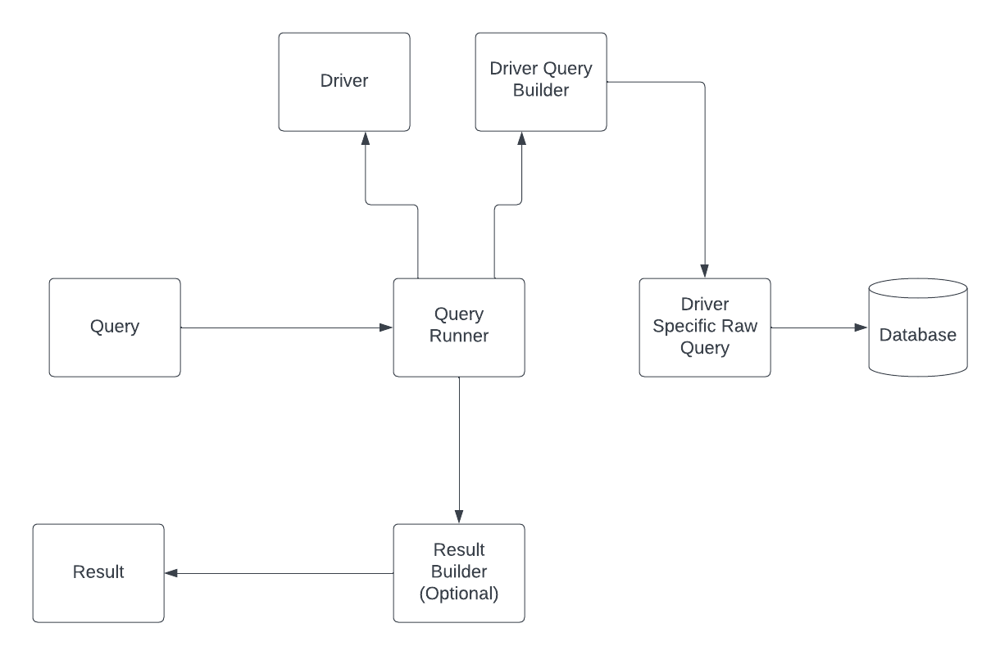

# Architecture

Architecture of PQL is separated in following segments:

* Query
* Driver Query Builder
* Driver
* Result Builder
* Query Runner

## Query

This is a general abstraction of the query that the user will be using. It supports all common keywords and elements
that a specific database type supports.

### SQL Queries

For queries specific to SQL databases, they will be in Sql/Query namespace.

User creates this query by using various helper functions like `select()`, `insert()`, `update()`, `delete()` or their
class counter parts `Select`, `Insert`, `Update`, `Delete`, each of these methods or classes support method 
chaining for adding conditions, joins, limits, offsets, etc.

All of these inherit from the same `StructuredQuery` interface and can be combined between in various ways opening
up many different approaches for any kind of complex query.

## Driver Query Builder

This query builder takes a Query as an input and returns a Raw Query as an output.

Builder creates a driver specific representation of the query which can be
a string in case of a SQL builder or different results like arrays depending on what a specific driver needs.

## Driver

This is the main executor of the driver specific query. It accepts a Raw query and performs all needed logic for
instantiation, like connecting to the database, providing credentials, setting up configurations etc.

This driver will pass the raw query into the database as a request and return the resulting data from the database

## Result Builder

Results from the driver are passed into result builder. Result builder allows for a final preprocessing step before
the data is actually returned. User can use a result builder to set a pipeline for processing specific results
and create things like ORM.

## Query Runner

Query runner combines a Driver, Driver Query Builder and a Result Builder into a simple-to-use package so that the
user can instantiate everything once, pass it into Query Runner and then just process queries through Query Runner.
This abstraction provides different ways of retrieving data from taking one record, multiple, or to process it 
through a result builder.

